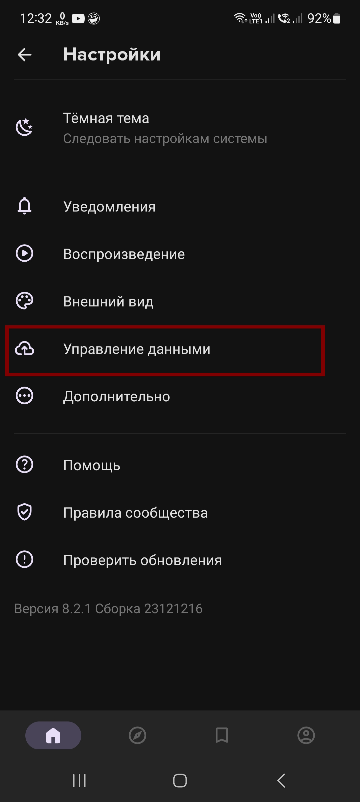
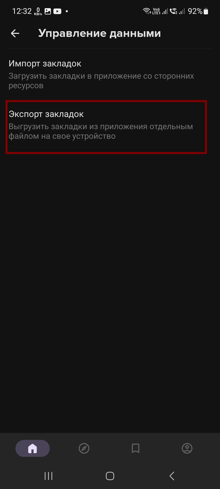
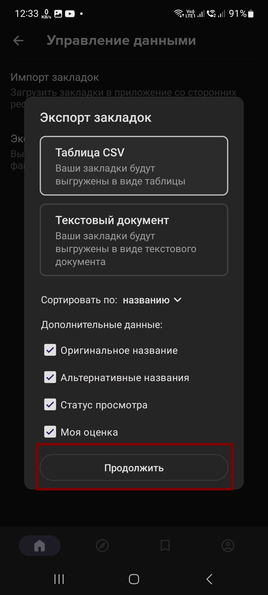

# anixart2hikka
The script move your bookmarks from [Anixart](https://anixart.tv) app to [hikka.io](https://hikka.io) site

## Installation

You can install reqests lib using git and terminal:

```bash
pip install reqests
git clone https://github.com/MrIkso/anixart2hikka
```
## Export Bookmarks form Anixart
1. Goto Settings menu
2. Goto data management

    

3. Goto Export bookmarks

    
   
4. Export bookmarks via parameters in screenshot

    
   
5. Copy exported *.csv file in PC

## Authorisation
How to get auth code to use methods associated with your profile
1. Copy the value of the `Auth` header from F12 menu.


## Usage

Run script via terminal

```bash
anixart2hikka.py --csv_file your_csv_file --token your_token
```

## Documentation

The official documentation can be found at [api.hikka.io](https://api.hikka.io/docs#)

## Contributing

If you'd like to contribute to this project, please fork the repository and create a pull request. You can also open an issue if you find any bugs or have any feature requests.